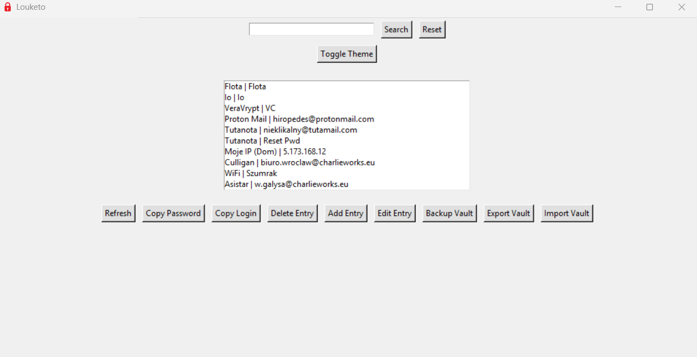
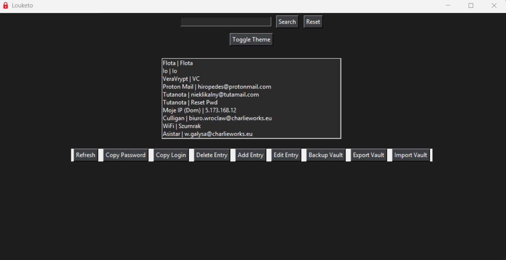
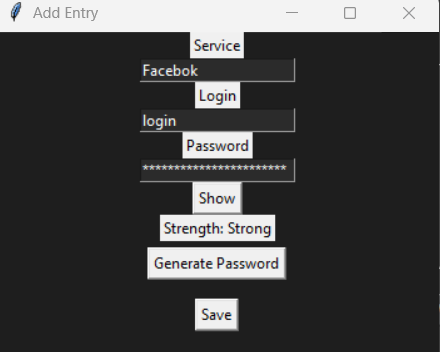

#  Louketo Password Manager

Louketo is a lightweight desktop password manager written in Python.

The application stores credentials in an encrypted vault protected by a master password and provides tools for password generation, strength analysis and secure credential management.

---

## Features

-  Master password authentication
-  Encrypted password vault
-  Search stored credentials
-  Clipboard copy for login/password
-  Add and edit entries
-  Delete entries
-  Password generator
-  Password strength meter
-  Vault backup system
-  Export vault to JSON
-  Import vault from JSON
-  Light / Dark theme

---

## Technology

- Python
- Tkinter GUI
- SHA256 password hashing
- Custom vault encryption
- JSON data export/import

---

## Application Preview

### Main Interface


### Dark Theme


### Add Entry


---

## Installation

Clone the repository:

```bash
git clone https://github.com/czuameni/golden-vault.git
